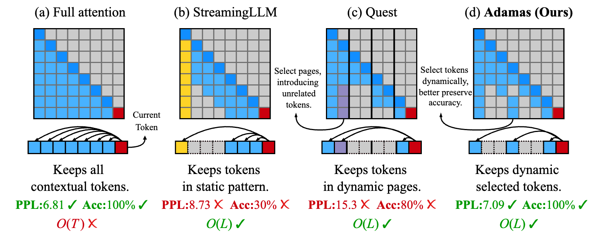

# Adamas: Hadamard Sparse Attention for Efficient Long-Context Inference



## TL;DR

We present Adamas, a lightweight yet accurate sparse attention mechanism, achieving up to 4.4× self-attention and 1.5× end-to-end speedups on 32K sequences with near-lossless accuracy.

## Abstract

Large language models (LLMs) now support context windows of hundreds of thousands to millions of tokens, enabling applications such as long-document summarization, large-scale code synthesis, multi-document question answering and persistent multi-turn dialogue. However, such extended contexts exacerbate the quadratic cost of self-attention, leading to severe latency in autoregressive decoding. Existing sparse attention methods alleviate these costs but rely on heuristic patterns that struggle to recall critical key-value (KV) pairs for each query, resulting in accuracy degradation. We introduce Adamas, a lightweight yet highly accurate sparse attention mechanism designed for long-context inference. Adamas applies the Hadamard transform, bucketization and 2-bit compression to produce compact representations, and leverages Manhattan-distance estimation for efficient top-k selections. Experiments show that Adamas matches the accuracy of full attention with only a 64-token budget, achieves near-lossless performance at 128, and supports up to 8x higher sparsity than prior state-of-the-art (SOTA) methods while delivering up to 4.4x self-attention and 1.5x end-to-end speedups on 32K-length sequences. Remarkably, Adamas attains comparable or even lower perplexity than full attention, underscoring its effectiveness in maintaining accuracy under aggressive sparsity. 

## Installation

1. Clone the repository:

```
git clone --recurse-submodules https://github.com/FibonaccciYan/Adamas
cd Adamas
```

2. Install dependency libraries:

```
conda create -yn adamas python=3.10
conda activate adamas

# Adamas
pip install -e .

# Flash-Attention
pip install ninja packaging
pip install flash-attn==2.5.8 --no-build-isolation

# Install CMake (with version >= 3.26.4)
conda install cmake

# build libraft
cd kernels/3rdparty/raft
./build.sh libraft

# build faster_hadamard_transform
cd kernels/3rdparty/applied-ai/kernels/cuda/inference/hadamard_transform
pip install -e .
```

3. Compile kernel benchmarks (Optional).

```
cd kernels
mkdir build && cd build
cmake ..
make -j
```

4. Build end-to-end operators

```
cd adamas/ops
bash setup.sh
```

## Accuracy Evaluation

Our evaluations are based on [LongChat-7B-v1.5-32K](https://huggingface.co/lmsys/longchat-7b-v1.5-32k?clone=true) and [Yarn-Llama2-7B-128K](https://huggingface.co/NousResearch/Yarn-Llama-2-7b-128k) models, which are capable of handling long-context text generations. We evaluate passkey retrieval, LongBench benchmarks and PG-19 perplexity tests. We provide several scripts to reproduce our results in the paper:

To get the Passkey Retrieval results, please modify and execute:

```
bash scripts/passkey.sh
```

To reproduce the LongBench results, please modify and execute:

```
bash scripts/longbench.sh
```

To evaluate the perplexity results of PG-19, please execute:

```
bash scripts/ppl_eval.sh
```

## Efficiency Evaluation

Kernels and end-to-end effiency are evaluated on NVIDIA A6000 GPUs with CUDA version of 12.4. We provide several scripts to reproduce our results in the paper:

### Kernel-level Efficiency

To reproduce the kernel performance shown in paper, please execute:

```
bash scripts/bench_kernels.sh
```

We also release the unit tests and benchmarks used for kernel implementations. Correctness of kernel is verified by unit tests in kernels/src/test, while performance is evaluated by NVBench in kernels/src/bench. We also test the correctness of PyBind operators in adamas/tests with PyTorch results via PyTest.

(WIP) To test the correctness of kernels, please execute:

```
cd kernels/build
./test_batch_decode # or any other operator
```

(Recommended) Or utilize PyTest:

```
cd adamas/tests
PYTHONPATH=$PYTHONPATH:../../ pytest
```


### End-to-end Efficiency

Adamas can achieve up to 1.5x end-to-end speedup on 32K sequences with near-lossless accuracy. We incorporate all implemented operators into a full pipeline to evaluate the end-to-end efficiency in text generations based on the [Huggingface Transformers](https://github.com/huggingface/transformers/blob/main/src/transformers/models/llama/modeling_llama.py) as shown in adamas/models/Adamas.py.

To reproduce the end-to-end efficiency results, please execute:

```
bash scripts/bench_efficiency_e2e.sh
```

## Examples

We provide several examples to demonstrate the usage of Quest. These examples are implemented with the end-to-end integration of Quest operators, and can be executed with the following commands (please make sure you have setup all the operators):

```
python3 scripts/example_textgen.py
```

## Reference

If you find this project useful for your research, please consider citing our paper：
```
@misc{yan2025adamas,
    title = {Adamas: Hadamard Sparse Attention for Efficient Long-Context Inference},
    author = {Siyuan Yan and Guo-Qing Jiang and Yuchen Zhang and Xiaoxing Ma and Ran Zhu and Chun Cao and Jingwei Xu},
    year = {2025},
    eprint = {arXiv:2510.18413},
}
```

## Credits

This codebase is built upon [Quest](https://github.com/mit-han-lab/Quest)
. We sincerely thank the authors for their excellent work!
